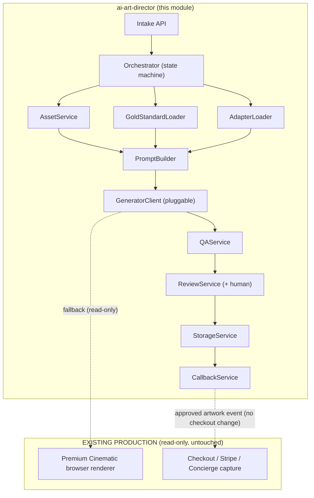

# Architecture — AI Art Director

**Deliverable #2.** Components, responsibilities, and how the pipeline coexists with
the live browser renderer. (Data-flow diagrams are in `DATA_FLOW.md`, #3.)

## 1. Design goals

| Goal | How the architecture achieves it |
|------|----------------------------------|
| One design language across all products | A shared **Gold Standard** (visual DNA) that every product inherits |
| New products with no pipeline changes | Product-specific **Adapters** (content only) |
| Never ship art a human hasn't approved | A mandatory **Review** gate with automated QA + human approval before delivery |
| Reproducible artwork | Everything pinned & versioned: gold standard + adapter + prompt + model + seed |
| Safe adoption | Runs behind a flag; **falls back to the existing browser renderer** on any failure |
| Independent service | Async, queue-driven, stateless workers; no coupling to the live app |

## 2. Components & responsibilities

Each is a **service boundary** (typed contract in `services/contracts.ts`), not an
implementation in this milestone.

| Service | Responsibility | Reads | Writes |
|---------|----------------|-------|--------|
| **Intake API** | Accept a job (customer photos + product + inputs), validate, enqueue | request | `queues/` job |
| **Orchestrator** | Drive the pipeline state machine; coordinate the services below; own retries/timeouts | job | pipeline state |
| **AssetService** | Fetch & normalize customer photos (orientation, color space, resolution, dedupe); host decorative assets/fonts | photo refs, `assets/` | normalized assets |
| **GoldStandardLoader** | Resolve & pin the versioned Gold Standard for the product | `gold-standards/` | pinned DNA |
| **AdapterLoader** | Resolve & pin the versioned product Adapter | `adapters/` | pinned content pack |
| **PromptBuilder** | Compose the layered, versioned prompt from DNA + adapter + inputs + safety | DNA, adapter, inputs | prompt bundle |
| **GeneratorClient** | Pluggable boundary to a generation backend (hero cutout, scene/atmosphere, compositor) — **and the existing browser renderer as a fallback generator** | prompt bundle, assets | candidate artwork |
| **QAService** | Automated gates: safety, brand/constitution, "masterpiece test", WOW score ≥ threshold, print-readiness (DPI, bleed, safe area), face/identity integrity, no-duplicate-photos | candidate | QA verdict |
| **ReviewService** | Human-in-the-loop approval; state machine; concierge/owner tooling | QA verdict, candidate | review record |
| **StorageService** | Content-addressed storage of inputs, candidates, approved outputs, manifests | all artifacts | `outputs/`, manifests |
| **CallbackService** | Notify the ordering system when artwork is approved/failed (no checkout changes — read-only handoff) | review record | webhook/event |

### The generator is pluggable (and includes the current renderer)

`GeneratorClient` is an interface with multiple backends selected per stage:

- `browser-renderer` — the **existing** Premium Cinematic canvas renderer, invoked
  headlessly as a **deterministic fallback** and as the baseline/reference. (Used
  read-only; never modified.)
- `bg-removal` — hero background removal → transparent cutout (concierge-manual
  today; a model later).
- `scene` — text-to-image / diffusion for cinematic background & atmosphere.
- `compositor` — deterministic layer compositor that assembles hero + collage +
  decorations + text at 300 DPI (this is where the Gold Standard geometry lives).

This lets the pipeline mix AI (atmosphere, cutout) with deterministic composition
(geometry, text, print specs) — and always degrade to the pure browser renderer.

## 3. Layering (who owns what)

```
┌──────────────────────────────────────────────────────────────┐
│ GOLD STANDARD  — visual DNA: composition grid, lighting,      │  shared by ALL products
│                  palette rules, hierarchy, print spec, style   │
├──────────────────────────────────────────────────────────────┤
│ ADAPTER        — product content: wording, decorations,        │  one per product
│                  footer values, fields, photo-slot meanings,   │
│                  prompt fragments, gold-standard binding        │
├──────────────────────────────────────────────────────────────┤
│ CUSTOMER INPUT — photos + text (name, year, colors, …)         │  one per order
├──────────────────────────────────────────────────────────────┤
│ PROMPT BUILDER — composes the above (+ safety) into a prompt   │  deterministic
│                  bundle, pinned & versioned                     │
├──────────────────────────────────────────────────────────────┤
│ GENERATORS     — produce candidate artwork (AI + compositor +  │  pluggable
│                  browser-renderer fallback)                     │
├──────────────────────────────────────────────────────────────┤
│ QA + REVIEW    — automated gates then human approval            │  mandatory
└──────────────────────────────────────────────────────────────┘
```

## 4. Component diagram



## 5. Coexistence & rollout (safety)

1. **Shadow mode** — pipeline runs *after* the browser render, produces a candidate,
   stores it for owner review. Customer sees nothing new. (First adoption step.)
2. **Assisted mode** — approved AI artwork becomes an *option* in concierge
   fulfillment alongside the browser render.
3. **Opt-in mode** — a per-product feature flag routes selected orders to the AI
   path; browser renderer remains default + fallback.
4. **Default** — only after sustained QA pass rates and owner sign-off.

At every stage the browser renderer stays the fallback, and the customer-facing
checkout/concierge flow is unchanged.

## 6. Non-goals for this milestone

- No external AI API calls, keys, or SDKs.
- No generator implementations (only the typed boundary).
- No changes to checkout, Stripe, concierge, marketing, or the existing renderer.
- No queue infrastructure provisioning — only the message/contract schemas.
