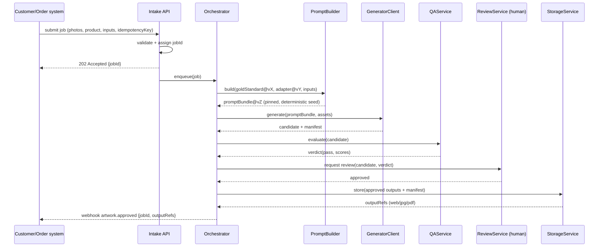

# Data Flow — AI Art Director

**Deliverable #3.** How a single order moves from customer inputs to an
approved, print-ready keepsake.

## 1. End-to-end pipeline (flowchart)

```mermaid
flowchart LR
  IN["Customer inputs\n(photos + product + text + colors)"] --> API[Intake API\nvalidate]
  API -->|enqueue job| Q1[(jobs queue)]
  Q1 --> ORCH[Orchestrator]

  ORCH --> A[AssetService\nnormalize photos:\norientation · color space ·\nresolution · dedupe]
  ORCH --> G[GoldStandardLoader\npin visual DNA vX]
  ORCH --> D[AdapterLoader\npin product adapter vY]

  A & G & D --> P[PromptBuilder\ncompose + pin\nprompt bundle vZ]

  P --> GEN{GeneratorClient}
  GEN --> HC[hero cutout]
  GEN --> SC[scene / atmosphere]
  GEN --> CMP[compositor\n300 DPI · geometry · text]
  GEN -. fallback .-> BR[browser renderer\n(existing, read-only)]

  HC & SC & CMP --> CAND["candidate artwork\n+ manifest"]
  CAND --> QA{QAService gates}
  QA -->|fail| RETRY[retry / regen\nor fallback]
  RETRY --> GEN
  QA -->|pass| Q2[(review queue)]
  Q2 --> REV["ReviewService\nautomated summary +\nHUMAN approval"]
  REV -->|reject| RETRY
  REV -->|approve| STORE[StorageService\ncontent-addressed]
  STORE --> OUT["outputs/:\nweb preview · print JPG ·\nprint PDF · manifest"]
  OUT --> CB["CallbackService\nartwork-approved event"]
  CB -. read-only handoff .-> FUL["existing fulfillment /\nconcierge (unchanged)"]
```

## 2. Sequence (happy path)



## 3. Pipeline states

`RECEIVED → NORMALIZING → PROMPTING → GENERATING → QA → REVIEW → APPROVED → STORED → DELIVERED`

Terminal/branch states: `QA_FAILED`, `REVIEW_REJECTED`, `RETRYING`, `FELL_BACK`
(browser renderer used), `FAILED` (dead-letter), `CANCELLED`.

State transitions, retry rules, and idempotency are specified in `ERROR_HANDLING.md`.

## 4. What crosses the boundary to production (only this)

- **In:** a read-only copy of the customer's uploaded photos + the product/inputs
  (the same data concierge capture already stores). No checkout/Stripe coupling.
- **Out:** an `artwork.approved` (or `artwork.failed`) event with output references.
  The existing fulfillment picks these up **read-only**; no checkout, pricing, or
  concierge code is modified.

Everything else stays inside `ai-art-director/`.
