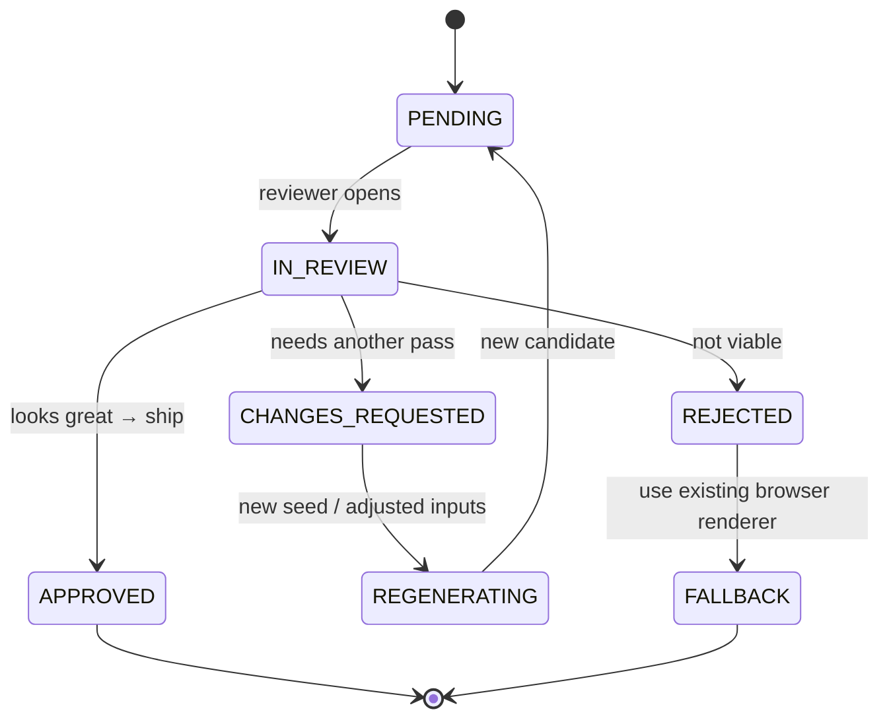

# Review Workflow

**Deliverable #7.** No AI-generated artwork reaches a customer without passing
automated QA gates **and** a human approval. This is the safety spine of the pipeline.

## 1. Two gates, in order

```
candidate ──▶ [Gate A: automated QA] ──pass──▶ [Gate B: human review] ──approve──▶ deliver
                    │ fail                             │ reject
                    ▼                                  ▼
              retry / regen / fall back to browser renderer
```

A candidate that fails either gate never becomes a customer deliverable.

## 2. Gate A — automated QA (`QAService`)

All gates must pass. Each emits a score + reasons into the review record.

| Gate | Checks | Fail action |
|------|--------|-------------|
| **Safety** | no disallowed content; input photos not NSFW/abusive | hard stop → human |
| **Brand / constitution** | matches gold-standard style & composition contract | regen |
| **Masterpiece test** | "is this gallery-worthy?" heuristic threshold | regen |
| **WOW score** | aggregate aesthetic score ≥ threshold (e.g. 0.80) | regen |
| **Identity integrity** | hero face preserved, not altered/replaced | hard stop → human |
| **No duplicate photos** | each customer photo used at most once as intended | regen |
| **Print-readiness** | 300 DPI, correct size, bleed present, safe-area clear, CMYK-safe | regen or compositor fix |
| **Legibility** | name/footer text contrast floor met | regen |

Thresholds are config, versioned with the pipeline (see `VERSIONING.md`). Every
gate result is recorded for auditability, not just pass/fail.

## 3. Gate B — human review (`ReviewService`)

A reviewer (owner/concierge) sees: the candidate, the QA scorecard, the pinned
inputs (gold standard + adapter + prompt bundle + seed), and the customer's photos.

Review record state machine:



- **APPROVED** → outputs are finalized and the `artwork.approved` event fires.
- **CHANGES_REQUESTED** → orchestrator regenerates (new seed and/or tweaked inputs),
  producing a fresh candidate that re-enters Gate A.
- **REJECTED / repeated failure** → **fall back to the existing browser renderer** so
  the order is always fulfillable. This is the guarantee that the AI path can never
  block a sale.

## 4. Review record (audit trail)

Every review persists a record (schema: `review/review-record.schema.json`) capturing
job id, candidate ref, QA scorecard, all pinned versions/seed, reviewer, decision,
notes, and timestamps — enough to reproduce or explain any decision later.

## 5. Owner tooling (reuses existing pattern)

The human step reuses the established **owner review** pattern already used for the
Team Cinematic renderer (zoom, fit, fullscreen, inspection guides that never export).
That tool is read-only over production and is not customer-facing — consistent with
the existing `team-cinematic-review.html`. No customer-facing or checkout code is
introduced by this workflow.

## 6. Rollout tie-in

In **shadow mode** the review gate runs with no customer impact (owner reviews
candidates for quality calibration). Only after sustained Gate-A pass rates and owner
sign-off does any product move toward opt-in (see `ARCHITECTURE.md` §5).
